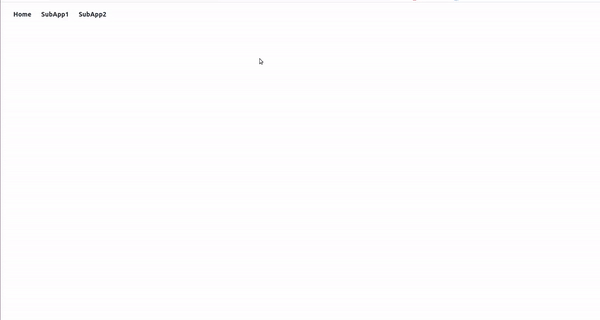

# microfrontend-react

React micro-frontend reference repo. Two complete demos, same product shape (host shell + two remotes), different integration contracts.

<p align="center">
  
</p>

---

## What is a micro-frontend?

A **micro-frontend (MFE)** splits a UI into independently built, versioned, and deployable apps that compose into one user experience at runtime.

| Monolith SPA | Micro-frontends |
| --- | --- |
| One repo, one deploy, one team bottleneck | Multiple apps, independent deploys |
| Shared release train for every change | Teams ship their slice on their schedule |
| One tech lock-in for the whole product | Host + remotes can evolve (with care) |
| Simple mental model | Need clear ownership boundaries + contracts |

**Typical use cases**

- Large product with multiple teams (checkout, account, admin, marketing).
- Migrate a legacy SPA gradually (“strangler” pattern) without a big-bang rewrite.
- Embed a feature built by another team/org into your shell.
- Share a design-system host while feature teams own remotes.
- Run the same remote standalone (for local/dev) and inside the host (for users).

**What you still need (non-negotiable)**

- Clear **ownership** (who owns which route/feature).
- A **runtime contract** (how host loads remote; how unmount works).
- Aligned **shared deps** strategy (especially React — one tree or intentional isolation).
- **CORS / CDN URLs** for remotes in each environment.
- Shared **routing / auth / theming** conventions (even if implemented separately).
- Observability: how to debug “remote failed to load” in production.

---

## Prerequisites (any flow in this repo)

| Need | Why |
| --- | --- |
| Node.js **18+** (MF demo prefers **20.19+**) | Tooling / Vite / CRA |
| npm **10+** | Workspaces + scripts |
| Modern browser | ESM remotes / CRA bundles |
| Three free ports: **3000**, **4001**, **4002** | Host + two remotes (do not run both demos at once) |

Optional for production patterns: CDN or static hosting per remote, reverse proxy, CI that builds remotes before/with host.

---

## Pick a flow

| Folder | Approach | Best for | Stack |
| --- | --- | --- | --- |
| [`module-federation/`](./module-federation) | **Module Federation** — `remoteEntry.js`, shared React singleton | New apps, production MF, shared deps | Vite 7 · React 19 · `@module-federation/vite` · React Router 7 |
| [`asset-manifest/`](./asset-manifest) | **Classic runtime load** — `asset-manifest.json` + script tags + `window.render*` | Learn original CRA pattern; legacy-style integration | CRA `react-scripts` 5 · React 18 · `react-app-rewired` · React Router 6 |

```text
microfrontend-react/
├── README.md                 ← you are here (strategy + both flows)
├── module-federation/        ← modern Module Federation demo
│   ├── README.md             ← deep dive + config
│   ├── container/            ← host
│   ├── sub-app1/             ← remote
│   └── sub-app2/             ← remote
└── asset-manifest/           ← classic asset-manifest demo
    ├── README.md             ← deep dive + config
    ├── container/            ← host
    ├── sub-app1/             ← remote
    └── sub-app2/             ← remote
```

| Topic | Module Federation | Asset manifest |
| --- | --- | --- |
| Bundler | Vite | webpack (`react-scripts`) |
| Contract | `remoteEntry.js` | `asset-manifest.json` |
| Load API | `import("remote/App")` | Inject `<script>` / `<link>` + `window.render*` |
| Shared React | Singleton share scope | Usually separate React copies |
| Best fit | Greenfield + serious multi-team | Teaching / older CRA-shaped apps |

---

## How micro-frontends are used (mental model)

```text
┌─────────────────────────────────────────────┐
│  HOST / SHELL (container)                   │
│  - layout, nav, auth shell, routing         │
│  - decides WHEN to load which remote        │
│                                             │
│   /home        → host-owned page            │
│   /subapp1     → loads Remote A             │
│   /subapp2     → loads Remote B             │
└───────────────┬───────────────┬─────────────┘
                │               │
                ▼               ▼
        ┌───────────┐   ┌───────────┐
        │ Remote A  │   │ Remote B  │
        │ own build │   │ own build │
        │ own CI    │   │ own CI    │
        └───────────┘   └───────────┘
```

**Host responsibilities:** chrome, top-level routes, loading remotes, shared auth token handoff (if any), error boundaries.

**Remote responsibilities:** feature UI, own data fetching, expose a mount/unmount or federated module, stay runnable standalone.

**Shared (decide explicitly):** React version policy, design tokens/CSS strategy, router basename, API client/auth.

---

## Using micro-frontends with a **new** application

Use this path when you control greenfield architecture.

### Recommended: Module Federation

1. **Create host shell** — layout + router only. No feature business logic in host long-term.
2. **Create remotes per domain** — e.g. `orders`, `profile`, `admin`. Each remote is its own Vite (or webpack) app.
3. **Define the contract early**
   - Remote `exposes`: `./App` or `./routes`
   - Host `remotes`: URL to `remoteEntry.js` per environment
   - `shared`: `react`, `react-dom` as `singleton: true`
4. **Wire host routes** — `lazy(() => import("orders/App"))` behind `<Suspense>`.
5. **Local DX** — run host + remotes with concurrently/workspaces (as in this repo).
6. **Deploy** — each remote to its own static origin; host config points at env-specific entry URLs.
7. **Harden** — error boundary per remote, version checks, fallback UI when remoteEntry fails.

Step-by-step in this repo → [`module-federation/README.md`](./module-federation/README.md)

### Alternative for learning: Asset manifest

Same product split, but remotes publish CRA `asset-manifest.json` and host injects scripts. Fine for understanding runtime composition; prefer Module Federation for new production systems.

→ [`asset-manifest/README.md`](./asset-manifest/README.md)

### New-app checklist

- [ ] Domain boundaries agreed (what lives in which remote)
- [ ] Host owns only shell concerns
- [ ] Shared dependency policy written (React singleton vs isolated)
- [ ] Env-specific remote URLs (local / staging / prod)
- [ ] Remotes runnable standalone for faster team loops
- [ ] CI builds remotes independently; host build does not compile remote source

---

## Using micro-frontends with an **existing** application

Use this path when you already have a SPA (or MPA) and want to extract or embed features.

### Pattern A — Existing app becomes the **host** (strangler)

Goal: keep current app as shell; peel features into remotes over time.

1. **Identify a vertical slice** — e.g. Settings page with clear route `/settings`.
2. **Extract slice into a remote app** — new package in monorepo or separate repo.
3. **Choose integration**
   - **Module Federation:** add federation plugin to existing bundler (Vite/webpack/Rspack) *or* migrate host to Vite first; expose remote `./Settings`; host replaces route with `import("settings/App")`.
   - **Asset manifest / runtime mount:** remote registers `window.renderSettings`; host mounts into a DOM node on that route (works even when host bundler is hard to change).
4. **Keep old code behind a feature flag** until remote is stable.
5. **Repeat** for next slices. Host shrinks; remotes grow.

```text
Week 0:  [======== Monolith SPA ========]
Week N:  [ Shell ] + [ Remote: Settings ] + [ still-monolith rest ]
Later:   [ Shell ] + [ Settings ] + [ Checkout ] + [ Admin ]
```

### Pattern B — Existing app becomes a **remote**

Goal: embed an already-shipped app inside a new or other shell.

1. **Add a mount API** to the existing app:
   - MF: `exposes: { "./App": "./src/App.jsx" }`
   - Classic: `window.renderMyApp(containerId, props)` + `window.unmountMyApp(containerId)`
2. **Ensure assets resolve from remote origin** (absolute public URL / `origin` / `CONTENT_HOST`).
3. **Enable CORS** on the remote’s static/dev server.
4. **Host** loads remote on a route or in a widget slot.
5. **Watch duplicate React** — if both host and remote bundle React, you can get invalid hook calls. Prefer shared singleton (MF) or mount remote in an iframe/web component boundary if isolation is required.

### Pattern C — Side-by-side during migration

- Old app keeps serving most routes.
- New shell proxies or links selected paths to remotes.
- Use reverse proxy so users see one origin while teams deploy separately.

### Existing-app checklist

- [ ] One vertical slice with clear route + API boundary
- [ ] Mount + unmount defined (no leaked listeners/roots)
- [ ] React duplication strategy chosen
- [ ] CSS isolation plan (CSS modules / prefix / shadow DOM / careful globals)
- [ ] Auth: cookie domain or token passed as prop/header convention
- [ ] Rollback: feature flag back to monolith route

---

## Detailed end-to-end flow (both demos)

### Local demo flow

1. Install **one** workspace (`module-federation` **or** `asset-manifest`).
2. Start host `:3000` + remotes `:4001` / `:4002`.
3. Open host → navigate Home / SubApp1 / SubApp2.
4. Optionally open remotes directly to confirm standalone mode.
5. Build remotes then host for production preview.

### Runtime flow — Module Federation

```text
Browser → host JS
       → route /subapp1
       → import("subapp1/App")
       → fetch http://localhost:4001/remoteEntry.js
       → resolve shared react/react-dom
       → execute exposed ./App
       → React renders remote inside host tree
```

### Runtime flow — Asset manifest

```text
Browser → host JS
       → route /subapp1
       → <MicroFrontend host="http://localhost:4001" name="subapp1" />
       → fetch /asset-manifest.json
       → inject main.css + main.js
       → call window.rendersubapp1("subapp1-container", history)
       → remote createRoot mounts into #subapp1-container
```

---

## Quick start

### Module Federation (recommended for new work)

```bash
cd module-federation
npm install
npm run dev
```

Or from repo root:

```bash
npm run install:mf
npm run dev:mf
```

Open **http://localhost:3000**

Full docs → **[module-federation/README.md](./module-federation/README.md)**

### Asset manifest (classic CRA flow)

```bash
cd asset-manifest
npm install
npm start
```

Or from repo root:

```bash
npm run install:am
npm run dev:am
```

Open **http://localhost:3000**

Full docs → **[asset-manifest/README.md](./asset-manifest/README.md)**

**Do not run both flows at once** — same ports.

---

## Root scripts

| Command | Action |
| --- | --- |
| `npm run install:mf` | Install Module Federation workspace |
| `npm run install:am` | Install asset-manifest workspace |
| `npm run install:all` | Install both |
| `npm run dev:mf` / `start:mf` | Run Module Federation demo |
| `npm run dev:am` / `start:am` | Run asset-manifest demo |
| `npm run build:mf` | Build Module Federation apps |
| `npm run build:am` | Build asset-manifest apps |

---

## Which should you use?

| Situation | Choose |
| --- | --- |
| New multi-team product | [`module-federation/`](./module-federation) |
| Existing Vite/webpack app, want shared React | Module Federation |
| Teaching / comparing to older blog posts | [`asset-manifest/`](./asset-manifest) |
| Host bundler hard to change; need quick embed | Asset-manifest style mount API |
| Need strongest long-term ecosystem bet | Module Federation |

---

## Further reading in this repo

| Doc | Contents |
| --- | --- |
| [module-federation/README.md](./module-federation/README.md) | Architecture, Vite configs, shared deps, prod notes, troubleshooting |
| [module-federation/container/README.md](./module-federation/container/README.md) | Host-only details |
| [module-federation/sub-app1/README.md](./module-federation/sub-app1/README.md) | Remote 1 |
| [module-federation/sub-app2/README.md](./module-federation/sub-app2/README.md) | Remote 2 |
| [asset-manifest/README.md](./asset-manifest/README.md) | CRA overrides, manifest loader, window API, troubleshooting |
| [asset-manifest/container/README.md](./asset-manifest/container/README.md) | Host + MicroFrontend |
| [asset-manifest/sub-app1/README.md](./asset-manifest/sub-app1/README.md) | Remote 1 mount API |
| [asset-manifest/sub-app2/README.md](./asset-manifest/sub-app2/README.md) | Remote 2 mount API |

---

## License

See [LICENSE](./LICENSE).
